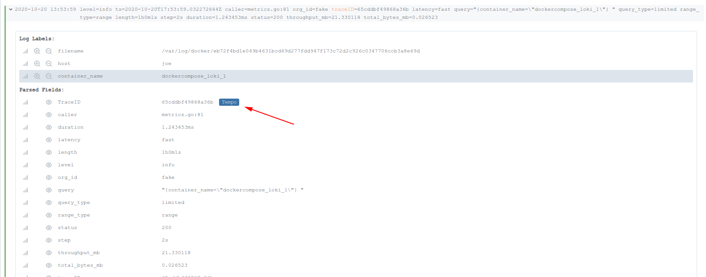

Some of the config in this repo comes from the [examples](https://github.com/grafana/tempo/blob/dee08207802e2e748c5a2fde881094a062da10f2/example/docker-compose/loki/readme.md) by [Grafana Labs](https://github.com/grafana), and there are many helpful resources to be found there!

## Run the Stack

`docker-compose up -d` to start the observability stack

`docker-compose ps` shows current Process Status:

```
           Name                         Command               State                    Ports                  
--------------------------------------------------------------------------------------------------------------
observability_grafana_1      /run.sh                          Up      0.0.0.0:3000->3000/tcp,:::3000->3000/tcp
observability_loki_1         /usr/bin/loki -config.file ...   Up      0.0.0.0:3100->3100/tcp,:::3100->3100/tcp
observability_prometheus_1   /bin/prometheus --config.f ...   Up      0.0.0.0:9090->9090/tcp,:::9090->9090/tcp
observability_tempo_1        /tempo -config.file=/etc/t ...   Up      0.0.0.0:59026->14268/tcp                
observability_vector_1       /usr/bin/vector -c /etc/ve ...   Up      0.0.0.0:8383->8383/tcp,:::8383->8383/tcp
```

`docker-compose down -v` to kill the observability stack


---
## Helpful Links

* [Grafana UI](http://localhost:3000)

  * [Loki in Grafana](http://localhost:3000/explore?orgId=1&left=%5B%22now-1h%22,%22now%22,%22Loki%22,%7B%7D%5D)

  * [Prometheus in Grafana](http://localhost:3000/explore?orgId=1&left=%5B%22now-1h%22,%22now%22,%22Prometheus%22,%7B%22exemplar%22:true%7D%5D)

  * [Tempo in Grafana](http://localhost:3000/explore?orgId=1&left=%5B%22now-1h%22,%22now%22,%22Tempo%22,%7B%22exemplar%22:true%7D%5D)

    * (displays "Query error: failed to get trace with id: Status: 404 Not Found Body: 404 page not found" until you search via `TraceID`)

* [Prometheus UI](http://localhost:9090)


---
## Example Usage

For the following examples, you can generate sample traces by:

  * Opening [Loki](http://localhost:3000/explore?orgId=1&left=%5B%22now-1h%22,%22now%22,%22Loki%22,%7B%7D%5D)

  * Querying Loki a few times to generate some traces (this setup does not use a synthetic load generator and all traces are generated from Loki)

    * "Run Query" of something like `{container_name="observability_loki_1"}` (where it says "enter a Loki query")

**Metrics -> Traces**

Prometheus' exemplars are a relatively new feature.  In order to use them, your metrics must have the `traceId` included in each `observation`.  See [this](https://vbehar.medium.com/using-prometheus-exemplars-to-jump-from-metrics-to-traces-in-grafana-249e721d4192) for how to configure your metrics with support for exemplars.

`./grafana-datasources.yaml` and `./docker-compose.yaml` have already been configured to support exemplars, after the above prerequisite.

**Traces -> Logs**

1) Find a `traceId` value via [Loki](http://localhost:3000/explore?orgId=1&left=%5B%22now-1h%22,%22now%22,%22Loki%22,%7B%7D%5D) query of `{container_name="observability_loki_1"} |= "traceId"`

2) Query for the above value in [Tempo](http://localhost:3000/explore?orgId=1&left=%5B%22now-1h%22,%22now%22,%22Tempo%22,%7B%22exemplar%22:true%7D%5D)

3) You have a couple options for how to navigate to Loki logs from Tempo traces:

  * A) Simply view the logs contained within each trace:

  

  * B) Use Grafana's `tracesToLogs` feature, which provides a "clickable log icon" on each trace, which would then take you to the relevant logs in Loki.  This requires all *traces* to be *tagged* with a value that points to the value of a *label* in your *logs*.  In this repo, `./grafana-datasources.yaml` is configured to use `tracesToLogs.tags=['container_name']`, which in turn points to the log label of `container_name` configured in `./vector.yaml`

    * See [this](https://grafana.com/docs/grafana/latest/explore/trace-integration/) for more info about the `tracesToLogs` feature

    * See [this](https://github.com/grafana/tempo/issues/735#issuecomment-899335996) for more info about configuring the feature

**Logs -> Traces**

1) Find a log with a `traceId` via [Loki](http://localhost:3000/explore?orgId=1&left=%5B%22now-1h%22,%22now%22,%22Loki%22,%7B%7D%5D) query of `{container_name="observability_loki_1"} |= "traceId"`

2) Drop down the log line and click the Tempo link to jump directly from logs to traces:




---
## Configure `YourApp` to Push/Pull to/from this `ObservabilityStack`

Let's say you have another project (`YourApp`), and you wish to implement Metrics/Logs/Traces using this `ObservabilityStack`

**Metrics**

* Prometheus works via a pull mechanism; expose a `/metrics` endpoint in `YourApp` that can be scraped by `ObservabilityStack`

  * Using a library like [this](https://github.com/prometheus/client_ruby), for example

  * Modify `./prometheus.yaml` with a scrape config to target your app for pulling the `/metrics` endpoint

**Logs**

* Loki works "automagically" (assuming `YourApp` is running in Docker)

  * The `vector` service in `./docker-compose.yaml` is configured to capture the stdout/stderr for any running Docker containers, and it will subsequently push them to `http://loki:3100/`

**Traces**

* Tempo works via a push mechanism; configure `YourApp` to push traces to `ObservabilityStack` @ `http://tempo:14268/api/traces`

  * Using a library like [this](https://github.com/salemove/zipkin-ruby-opentracing), for example
